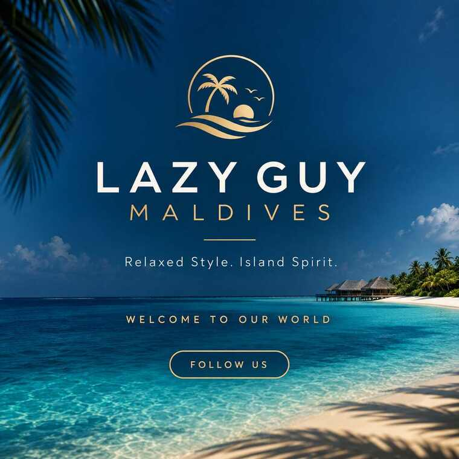
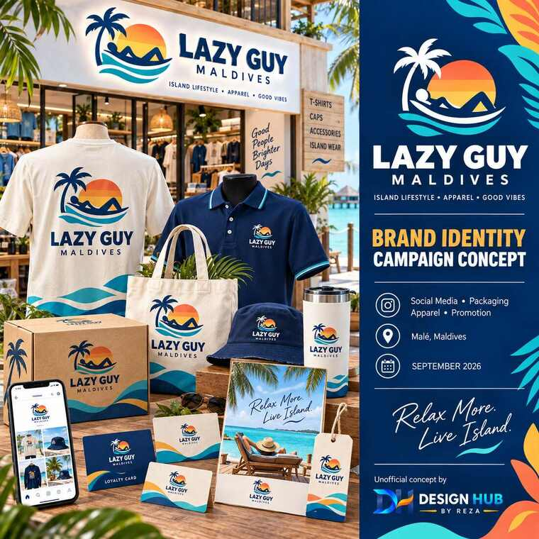
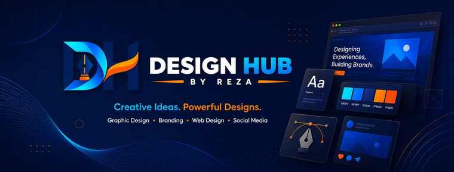
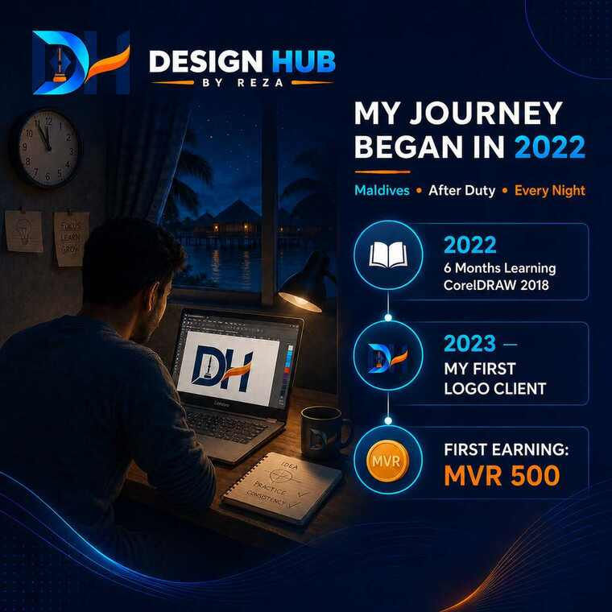
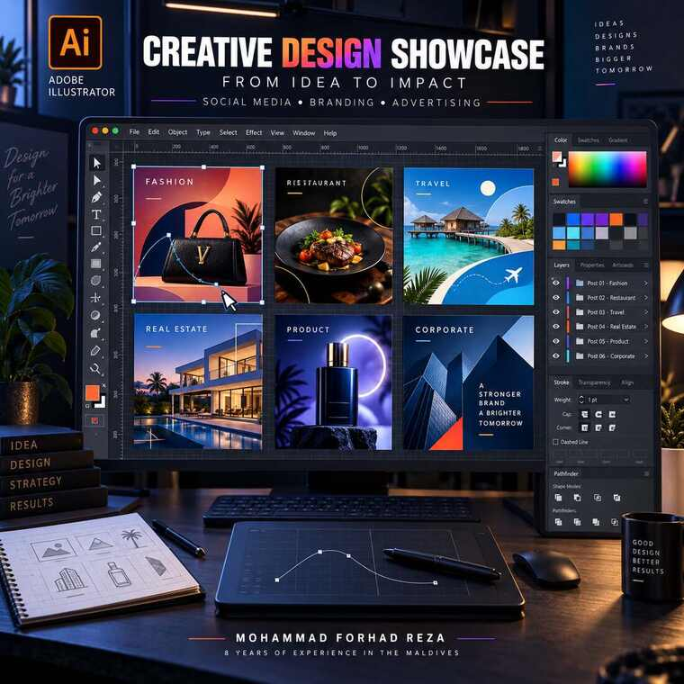

# Social Media Design Portfolio

### Mohammad Forhad Reza · Graphic Designer

Modern, premium social-media visuals created to help brands communicate clearly, build recognition, and connect with their audiences.

---

## Featured Work

<table>
<tr>
<td width="50%" valign="top">

</td>
<td width="50%" valign="top">

</td>
</tr>
</table>

### Lazy Guy Maldives

**Project type:** Brand introduction and island-lifestyle campaign concept  
**Creative direction:** Relaxed, premium, tropical, and recognizably Maldivian

**Challenge:** Create a strong first impression for a modern Maldives lifestyle brand while keeping the identity relaxed, memorable, and suitable for social media.

**Solution:** I developed a premium island-inspired direction using deep ocean blue, warm sunset gold, tropical imagery, confident typography, and a flexible visual identity. The concept extends naturally across social posts, apparel, packaging, promotional materials, and digital brand touchpoints.

**Design outcome:**

- Strong brand recognition
- Consistent tropical color palette
- Clear social-media hierarchy
- Flexible campaign applications
- Premium but approachable personality

---

<table>
<tr>
<td width="50%" valign="top">

</td>
<td width="50%" valign="top">

</td>
</tr>
</table>

### Design Hub by Reza

**Project type:** Personal creative-brand content  
**Creative direction:** Modern, energetic, professional, and technology-focused

**Challenge:** Show multiple graphic-design capabilities under one clear identity while communicating professional growth and creative ambition.

**Solution:** I built a dark-blue visual system with cyan and orange accents, bold typography, flowing graphic elements, and structured layouts. The system supports personal-brand storytelling, design-service promotion, portfolio showcases, and milestone posts.

**Storytelling highlight:** The “My Journey Began in 2022” concept presents my path from learning CorelDRAW after work in the Maldives to earning my first **MVR 500** from a logo project.

### Creative Design Showcase

This Adobe Illustrator concept demonstrates how one designer can create varied campaign styles—including fashion, restaurant, travel, real estate, product, and corporate design—while maintaining a polished presentation.

## Portfolio Focus

- Brand-introduction posts
- Promotional campaigns
- Product and service advertising
- Visual storytelling
- Social-media brand systems
- Platform-ready campaign assets

## My Process

1. Understand the brand, audience, objective, and platform.
2. Establish the message hierarchy and call to action.
3. Select the color, typography, imagery, and composition.
4. Design platform-appropriate creative variations.
5. Review readability and brand consistency.
6. Prepare polished final assets.

## Tools

  
  
  
  

## About the Designer

I am **Mohammad Forhad Reza**, a graphic designer with **8 years of creative experience in the Maldives**, including professional experience with **iTunes Maldives**.

[View my complete GitHub profile](https://github.com/designerhubbyreza) · [Connect on LinkedIn](https://www.linkedin.com/in/mohammad-forhad-reza-60761a438/)

---

### Creative ideas. Powerful designs. Clear communication.

