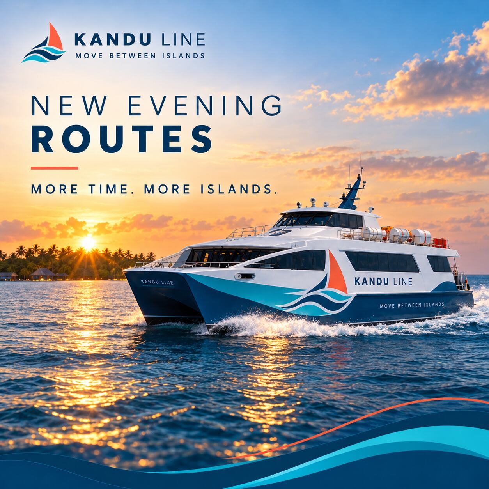
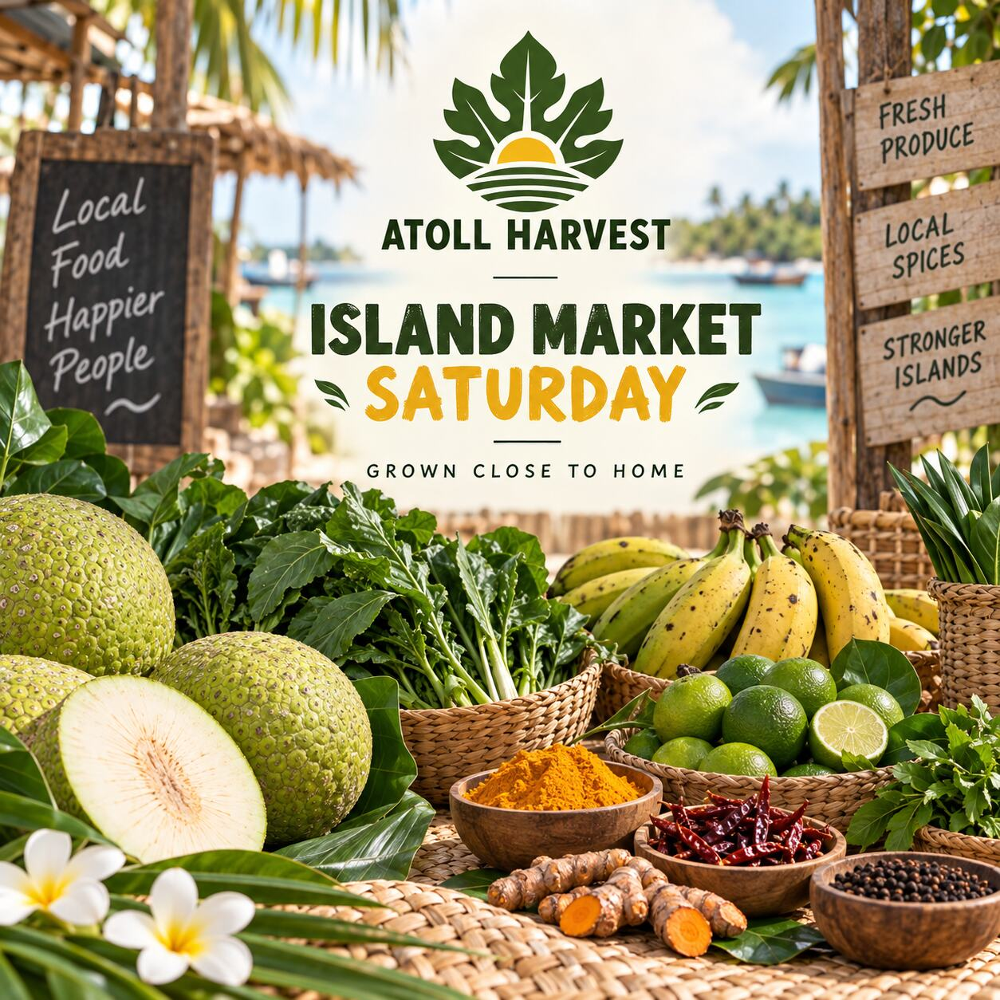
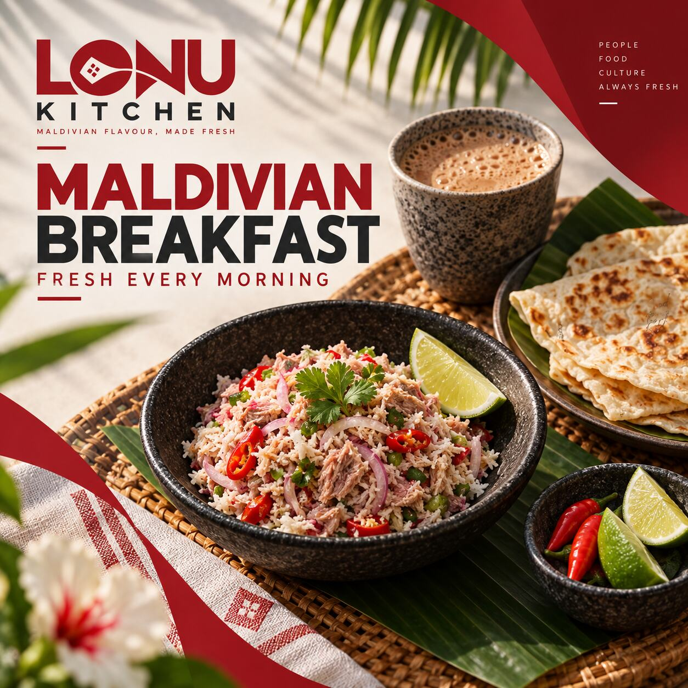
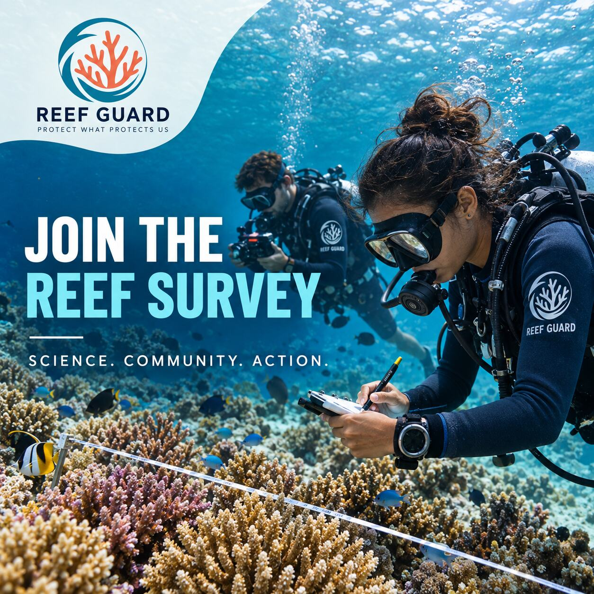
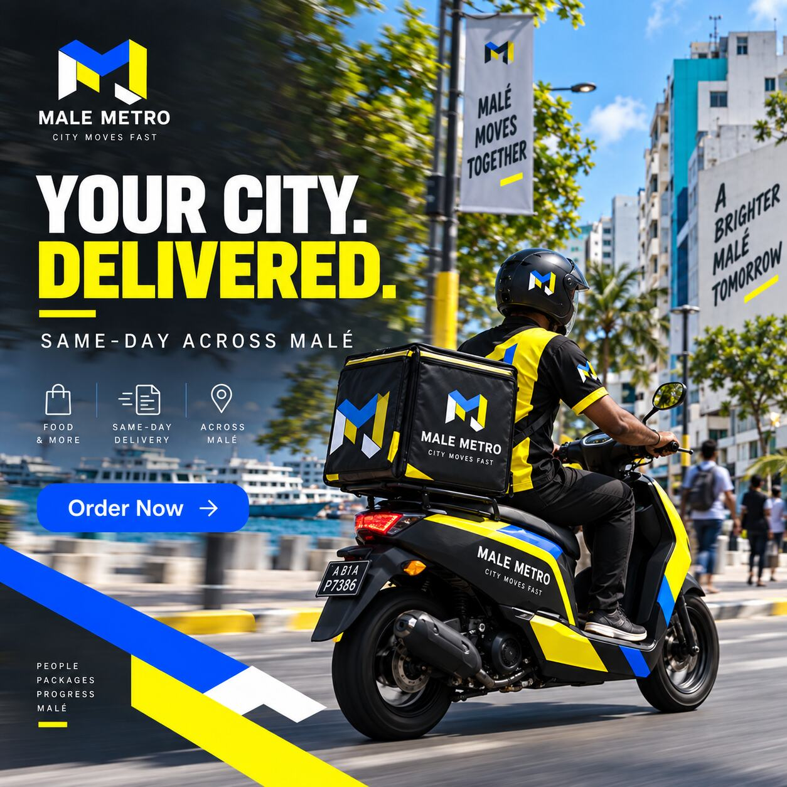

# Authentic Maldives Social Campaigns

### Five Original Campaign Concepts · No Reused Designs

A fresh social-media portfolio by **Mohammad Forhad Reza**, created around contemporary Maldives transport, local food, dining, conservation and urban life.

> All brands shown here are fictional self-initiated concepts created for portfolio demonstration.

## 01 · Kandu Line — New Evening Routes

**Campaign objective:** Announce a new evening ferry service with a confident, optimistic message.

**Design solution:** Golden-hour travel photography, strong information hierarchy and the brand’s ocean-blue and coral wave language communicate movement, reliability and connection.

## 02 · Atoll Harvest — Island Market Saturday

**Campaign objective:** Promote a weekend local-produce market.

**Design solution:** Fresh breadfruit, greens, bananas, lime and island spices create an authentic product story, while green and turmeric-yellow typography builds immediate recognition.

## 03 · Lonu Kitchen — Maldivian Breakfast

**Campaign objective:** Build morning traffic around a fresh Maldivian breakfast offer.

**Design solution:** Close, appetizing food photography gives mas huni and roshi a premium contemporary presentation, supported by bold red framing and direct promotional copy.

## 04 · Reef Guard — Join the Reef Survey

**Campaign objective:** Recruit volunteers for a community reef survey.

**Design solution:** Documentary underwater imagery and authoritative campaign typography position the initiative as science-led, active and credible.

## 05 · Malé Metro — Your City, Delivered

**Campaign objective:** Promote same-day delivery across Malé.

**Design solution:** A dynamic courier scene, urban setting, high-contrast yellow and blue branding, and an app-style call to action communicate speed and convenience.

## Why This Collection Is Different

- Every design begins with a Maldives-specific communication goal.
- The sectors and audiences are deliberately varied.
- Each campaign has its own visual system.
- The work represents local food, community, marine life, transport and city life—not only tourism.
- The layouts are designed for clear mobile viewing and fast message recognition.

## My Social Design Process

1. Define the campaign objective.
2. Identify the intended audience and platform.
3. Establish one clear message and call to action.
4. Use brand-consistent imagery, typography and color.
5. Test hierarchy and readability at mobile size.
6. Prepare adaptable campaign variations.

## Services Demonstrated

- Social-media art direction
- Campaign concept development
- Brand-consistent post design
- Promotional advertising
- Visual storytelling
- Food and lifestyle presentation
- Community and environmental communication

## About the Designer

I am **Mohammad Forhad Reza**, a graphic designer with **8 years of creative experience in the Maldives**.

[Main GitHub Profile](https://github.com/designerhubbyreza) · [LinkedIn](https://www.linkedin.com/in/mohammad-forhad-reza-60761a438/) · [Branding Portfolio](https://github.com/designerhubbyreza/branding-projects)
